# 博多ランチ食べたいもの

## 候補1.鮨隆(スシリュウ)
[食べログ](https://tabelog.com/fukuoka/A4001/A400101/40001476/)
 メモ
- 食べログ 寿司 WEST 百名店 2021に選ばれているお寿司屋さん。
   ディナーだったら10000〜15000円クラスのお店が、
   ランチだったら2000円程度で食べれる。

#### メニュー
寿司膳(八貫):1100円  
寿司膳(十二貫):1320円  
寿司セット(八貫):1650円  
寿司セット(十二貫):1870円  
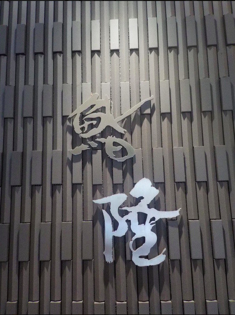
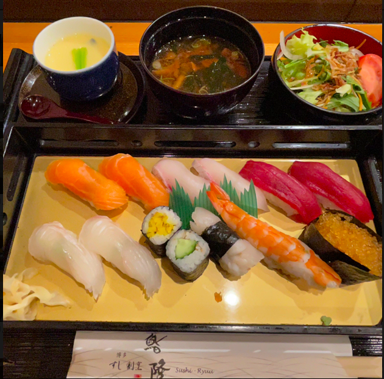

#### 場所
JR博多駅筑紫口から徒歩3分  
<iframe src="https://www.google.com/maps/embed?pb=!1m18!1m12!1m3!1d3323.582046630212!2d130.4205390151265!3d33.590199480734135!2m3!1f0!2f0!3f0!3m2!1i1024!2i768!4f13.1!3m3!1m2!1s0x354191c85b73b265%3A0x695946897e34f6a!2z44GZ44GX5Ymy54O5IOmuqOmahg!5e0!3m2!1sja!2sus!4v1637488428760!5m2!1sja!2sus" width="600" height="450" style="border:0;" allowfullscreen="" loading="lazy"></iframe>

## 候補2.博多水たき濱田屋 本店 
[食べログ](https://tabelog.com/fukuoka/A4001/A400101/40044969/dtlmenu/lunch/)

#### メニュー
水炊きセット（二名様より）:2750円  
・小鉢  
・水炊き（ぶつ切り、ミンチ、四つ身、肝、野菜）  
・めん又おじや  
濱田屋御膳:2178円  
・小鉢  
・季節の一品  
・唐揚げ  
・水炊き小鍋  
・御飯  
・香物  
・デザート  
ザ・プレミアム・モルツ:660円  
超炭酸ビームハイボール:550円  

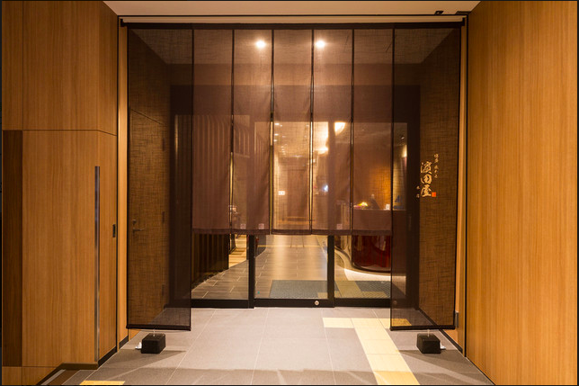
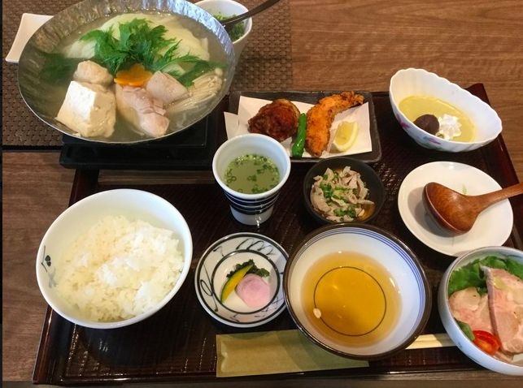

#### 場所
博多駅より徒歩約9分  
<iframe src="https://www.google.com/maps/embed?pb=!1m18!1m12!1m3!1d18556.71046877733!2d130.39958151917756!3d33.58880640574538!2m3!1f0!2f0!3f0!3m2!1i1024!2i768!4f13.1!3m3!1m2!1s0x354191be4105cfff%3A0x119bcb18c6a11ee1!2z5Y2a5aSa5rC044Gf44GNIOa_seeUsOWxiyDmnKzlupc!5e0!3m2!1sja!2sjp!4v1637489360894!5m2!1sja!2sjp" width="600" height="450" style="border:0;" allowfullscreen="" loading="lazy"></iframe>

## 候補3.元祖博多めんたい重  
[食べログ](https://tabelog.com/fukuoka/A4001/A400103/40025222/)

#### メニュー
【元祖博多めんたい重】1,848円  
手間ひまかけてじっくり漬け込んだ昆布巻き明太子まるごと1本を  
海苔を敷いたほかほかご飯の上に乗せ  
旨み成分たっぷりの「特製かけだれ」をかけて食べる新しい福岡の味。

生ビール スーパードライ中…748円  
生ビール スーパードライ小…528円   

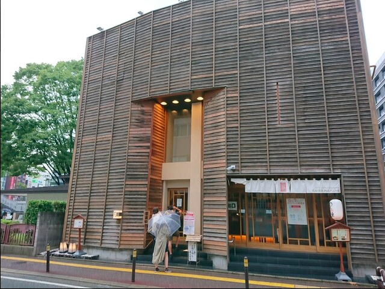
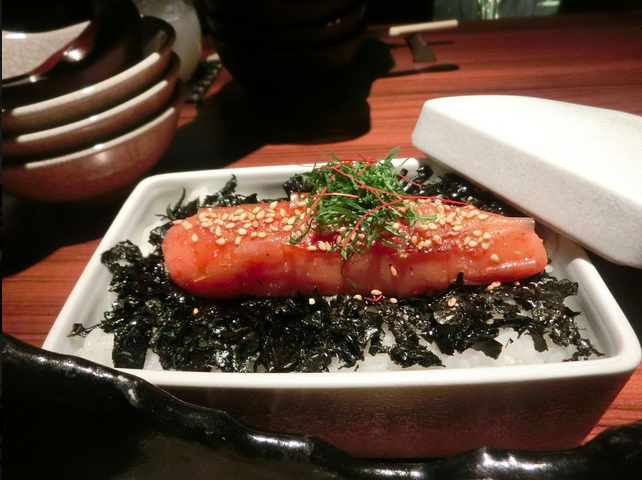

#### 場所
地下鉄中洲川端駅より徒歩５分（１番出口より）
<iframe src="https://www.google.com/maps/embed?pb=!1m14!1m8!1m3!1d3323.540687904614!2d130.404107!3d33.591273!3m2!1i1024!2i768!4f13.1!3m3!1m2!1s0x35419193dbe0b793%3A0xde0bd15c9081b8fc!2z5YWD56WW5Y2a5aSa44KB44KT44Gf44GE6YeN!5e0!3m2!1sja!2sus!4v1637489857723!5m2!1sja!2sus" width="600" height="450" style="border:0;" allowfullscreen="" loading="lazy"></iframe>

## 候補4.博多もつ鍋 やまや 博多店 
[食べログ](https://tabelog.com/fukuoka/A4001/A400101/40029725/)

#### メニュー
ランチだと辛子明太子・からし高菜・ごはんを好きなだけおかわりし放題
鶏の唐揚げめんたい風味定食:1200円
じっくりたれ漬け豚生姜焼き定食:1300円
もつ鍋膳:2000円 

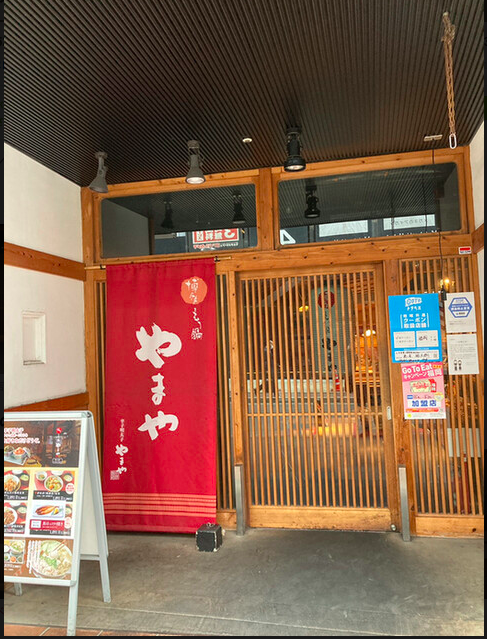
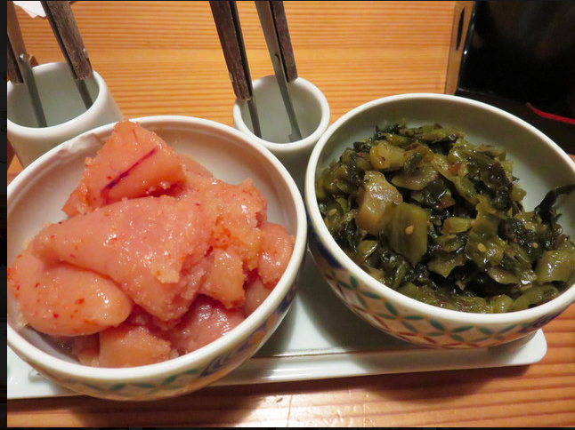
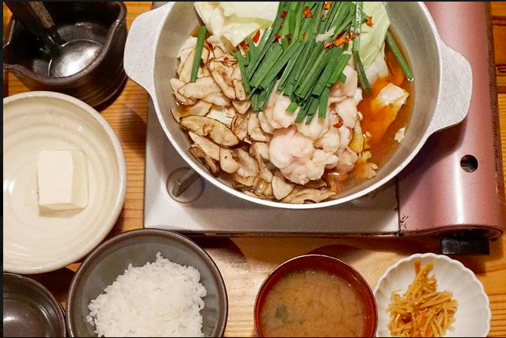

#### 場所
JR「博多駅」筑紫口より徒歩2分  
<iframe src="https://www.google.com/maps/embed?pb=!1m18!1m12!1m3!1d3323.648059028288!2d130.41903681512647!3d33.58848598073463!2m3!1f0!2f0!3f0!3m2!1i1024!2i768!4f13.1!3m3!1m2!1s0x354191c7ea885905%3A0x967132992d146167!2z5Y2a5aSa44KC44Gk6Y2L44KE44G-44KEIOWNmuWkmuW6lw!5e0!3m2!1sja!2sus!4v1637490528422!5m2!1sja!2sus" width="600" height="450" style="border:0;" allowfullscreen="" loading="lazy"></iframe>

## 候補5.博多一双 博多駅東本店 
[食べログ](https://tabelog.com/fukuoka/A4001/A400101/40032701/)

#### メニュー
Aランチ:700円  
・ラーメン・ごはん（おかわり自由）  
Ｂランチ:1,000円  
・ラーメン＋まかない丼  
ラーメン:680円  

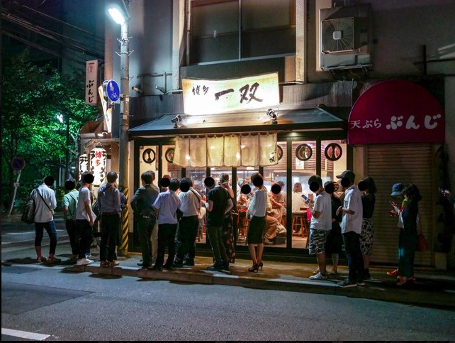
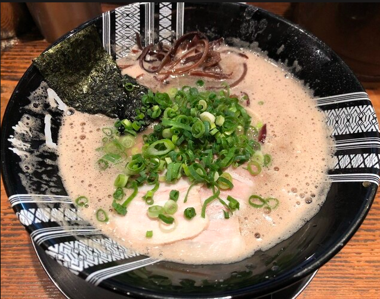

#### 場所
博多駅から徒歩6分
<iframe src="https://www.google.com/maps/embed?pb=!1m14!1m8!1m3!1d3323.730535896907!2d130.425102!3d33.586345!3m2!1i1024!2i768!4f13.1!3m3!1m2!1s0x354191b614dd0001%3A0xd021dc83c19d7221!2z5Y2a5aSa5LiA5Y-MIOWNmuWkmumnheadseacrOW6lw!5e0!3m2!1sja!2sus!4v1637491168749!5m2!1sja!2sus" width="600" height="450" style="border:0;" allowfullscreen="" loading="lazy"></iframe>