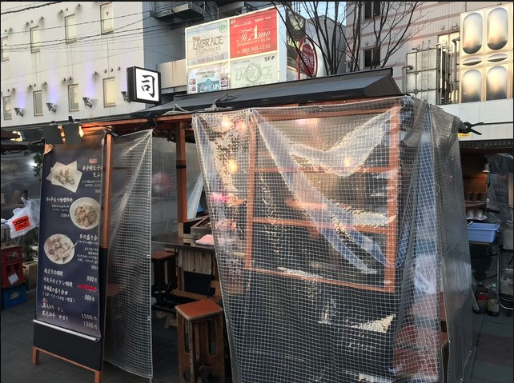
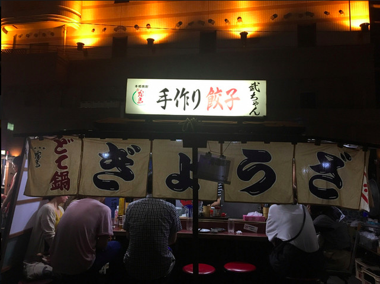

# 中洲屋台

## 中洲の屋台にいってみたい！
[福岡屋台](https://yokanavi.com/yatai/) 
[屋台リスト](https://yokanavi.com/yatai/list/)

### 屋台の場所
<iframe src="https://www.google.com/maps/embed?pb=!1m18!1m12!1m3!1d1375.3851529732437!2d130.40755626522912!3d33.590637780641266!2m3!1f0!2f0!3f0!3m2!1i1024!2i768!4f13.1!3m3!1m2!1s0x35419194423deedd%3A0xb40f574111c9447a!2z5Y-4!5e0!3m2!1sja!2sjp!4v1637486859100!5m2!1sja!2sjp" width="600" height="450" style="border:0;" allowfullscreen="" loading="lazy"></iframe>

- 行ってみたい屋台リスト
  - やまちゃん
   [食べログ](https://tabelog.com/fukuoka/A4001/A400102/40025736/?cid=yo_vc_nm&vc_lpp=MSY4OGQ4NmFkZTFmMCY2MTk5ZDIwZCYzMzVmOGQmNjE5YjIzOGMmWVpuU0RBQU9yTzB4bk04NENvSUFsUXFDQVQtd25RJjQJWVpuU0RBQU9yTzB4bk04NENvSUFsUXFDQVQtd25RCTA4ODQ3MTM4ODYwMjc5NzQ3MjIxMTEyMTA0NTg1MgkJaHR0cHM6Ly9hdW1vLmpwL2FydGljbGVzLzI5MDI4CXsiX2loIjoiUEdScGRpQmpiR0Z6Y3owaVVHOXpkQzF6Y0c5MExTMWhabVpwYkdsaGRHVXRMVzkwYUdWeWN5MHRZblJ1TFMxamIyNTBaVzUwSWo0OGFXMW5JR05zWVhOelBTSnNZWHA1Ykc5aFpDSWdaR0YwWVMxemNtTTlJbWgwZEhCek9pOHZiV1ZrYVdFdFlYTnpaWFJ6TG1GMWJXOHVhbkF2WVhOelpYUnpMMmx0WVdkbGN5OWhabVpwYkdsaGRHVXZZV1ptYVd4cFlYUmxYM1JoWW1Wc2IyZGZiRzluYjBBeWVDNXdibWNpSUdGc2REMGlkR0ZpWld4dlp5SWdjM0pqUFNJaVBqd3ZaR2wyUGciLCJfdXJpIjoiaHR0cHM6XC9cL3RhYmVsb2cuY29tXC9mdWt1b2thXC9BNDAwMVwvQTQwMDEwMlwvNDAwMjU3MzZcLyJ9)
   ジャンル:ラーメン、おでん、焼鳥
   長浜豚骨ラーメン:700円
   豚バラ3本セット:600円
   おでん3個:700円
   ビール(中瓶):700円
   ハイボール:600円
   梅酒:400円
   
  
  
  

  - 司
   [食べログ](https://tabelog.com/fukuoka/A4001/A400102/40025736/?cid=yo_vc_nm&vc_lpp=MSY4OGQ4NmFkZTFmMCY2MTk5ZDIwZCYzMzVmOGQmNjE5YjIzOGMmWVpuU0RBQU9yTzB4bk04NENvSUFsUXFDQVQtd25RJjQJWVpuU0RBQU9yTzB4bk04NENvSUFsUXFDQVQtd25RCTA4ODQ3MTM4ODYwMjc5NzQ3MjIxMTEyMTA0NTg1MgkJaHR0cHM6Ly9hdW1vLmpwL2FydGljbGVzLzI5MDI4CXsiX2loIjoiUEdScGRpQmpiR0Z6Y3owaVVHOXpkQzF6Y0c5MExTMWhabVpwYkdsaGRHVXRMVzkwYUdWeWN5MHRZblJ1TFMxamIyNTBaVzUwSWo0OGFXMW5JR05zWVhOelBTSnNZWHA1Ykc5aFpDSWdaR0YwWVMxemNtTTlJbWgwZEhCek9pOHZiV1ZrYVdFdFlYTnpaWFJ6TG1GMWJXOHVhbkF2WVhOelpYUnpMMmx0WVdkbGN5OWhabVpwYkdsaGRHVXZZV1ptYVd4cFlYUmxYM1JoWW1Wc2IyZGZiRzluYjBBeWVDNXdibWNpSUdGc2REMGlkR0ZpWld4dlp5SWdjM0pqUFNJaVBqd3ZaR2wyUGciLCJfdXJpIjoiaHR0cHM6XC9cL3RhYmVsb2cuY29tXC9mdWt1b2thXC9BNDAwMVwvQTQwMDEwMlwvNDAwMjU3MzZcLyJ9)
   ジャンル:天ぷら、串焼き
   辛子明太子の天ぷら:900円
   司の天ぷら盛り合わせ:900円
   司の串4本セット:900円
   ビール(中瓶):700円
   ハイボール:500円
   
  
  
  

  - 武ちゃん
   [食べログ](https://tabelog.com/fukuoka/A4001/A400102/40041197/?cid=yo_vc_nm&vc_lpp=MSY4YTUwZmI4MDFmMCY2MTk5ZDQ0YiYzMzVmOGQmNjE5YjI1Y2ImWVpuVVN3QUxuakF4bk04NHdLaHZhc0NvYjBkNHlRJjQJWVpuVVN3QUxuakF4bk04NHdLaHZhc0NvYjBkNHlRCTA4ODQ3MTM4ODYwMjc5NzQ3MjIxMTEyMTA1MDgyNwkJaHR0cHM6Ly9hdW1vLmpwL2FydGljbGVzLzI5MDI4CXsiX2loIjoiUEdScGRpQmpiR0Z6Y3owaVVHOXpkQzF6Y0c5MExTMWhabVpwYkdsaGRHVXRMVzkwYUdWeWN5MHRZblJ1TFMxamIyNTBaVzUwSWo0OGFXMW5JR05zWVhOelBTSnNZWHA1Ykc5aFpDSWdaR0YwWVMxemNtTTlJbWgwZEhCek9pOHZiV1ZrYVdFdFlYTnpaWFJ6TG1GMWJXOHVhbkF2WVhOelpYUnpMMmx0WVdkbGN5OWhabVpwYkdsaGRHVXZZV1ptYVd4cFlYUmxYM1JoWW1Wc2IyZGZiRzluYjBBeWVDNXdibWNpSUdGc2REMGlkR0ZpWld4dlp5SWdjM0pqUFNJaVBqd3ZaR2wyUGciLCJfdXJpIjoiaHR0cHM6XC9cL3RhYmVsb2cuY29tXC9mdWt1b2thXC9BNDAwMVwvQTQwMDEwMlwvNDAwNDExOTdcLyJ9)
   一口餃子:600円
   どて鍋:600円
   ホルモン:1000円
   豚キムチ:700円
   大手羽唐揚げ2本:700円
   ビール(中瓶):700円
   梅酒:500円
   
  
  
  

  - 博多屋台よっちゃん
   明太だし巻き卵焼き:900円
   野菜巻き3本盛り:800円
   
  
  