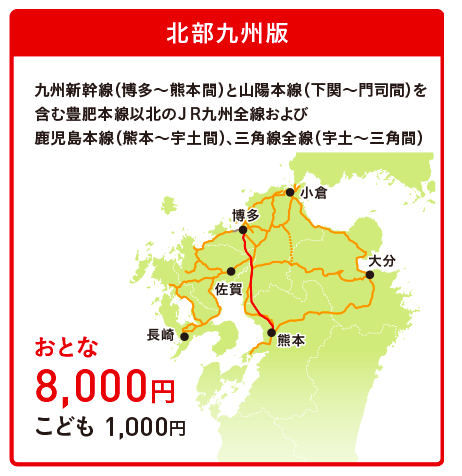

# 切符について

みんなの九州きっぷ北部九州版を購入済

## 使用できる場所
- 九州新幹線（博多～熊本間）、山陽本線（下関～門司間）を含む 
  豊肥本線以北のJR九州全線および鹿児島本線（熊本～宇土間）、三角線（宇土～三角間）

## 注意点
- JR九州の九州新幹線、特急列⾞、快速・普通列⾞に連続する2⽇間乗り降り⾃由なきっぷです。
- ご利⽤は、設定期間の連続する⼟曜⽇、⽇曜⽇限定です（有効期間2⽇）。
- いずれも普通⾞指定席を6回まで利⽤できます
- 自由席は乗り放題でご利用いただけます（全車指定席の列車を除く）。
- 福岡市地下鉄（博多～姪浜）はJRではないため対象外

## 指定券のとり方について
- 「ＪＲ九州インターネット列車予約」にて、 
  「みんなの九州きっぷ」を予約・決済（お支払い）いただき、 ＪＲ九州の主な駅の「指定席券売機」で受け取りください。 
  その後、お客さまご自身により「指定席券売機」の画面に表示された「回数券等への座席指定」ボタンより操作いただき、 
  「みんなの九州きっぷ」を挿入、ご希望の日時・列車・区間・人数等を指定いただくことで、指定券をお受取りいただくことができます。 
  ※「ＪＲ九州インターネット列車予約」での座席の予約ができかねます。 
  ※ＪＲ九州内の駅「みどりの窓口」でも承ります。 
  ※なお、指定券は乗車日 1 ヵ月前の 10 時からご予約いただけます。

## 九州を走る列車たち
- 九州新幹線…みずほ、さくら、つばめ
- 特急列車…かもめ、みどり、ハウステンボス、ソニック 
  にちりん、にちりんシーガイア、ひゅうが、きりしま、 
  きらめき、かいおう、あそ、ゆふ、九州横断特急
- Ｄ＆Ｓ列車…ゆふいんの森、Ａ列車で行こう、あそぼーい！、 
  指宿のたまて箱、かわせみ やませみ(※)、いさぶろう・しんぺい(※)、SL 人吉(※)、海幸山幸(※)

